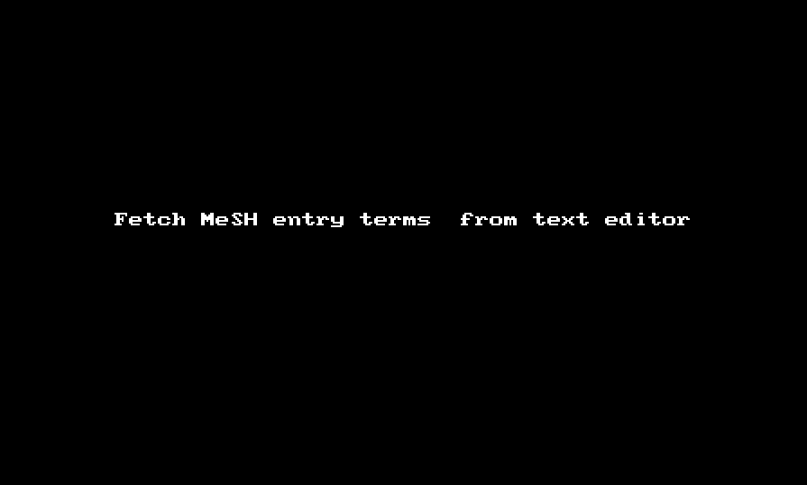

Command line tools for expert searchers
==============================================================================

This is a demo site for teaching purposes. It contains a small collection of tools that I use. The tools itself are contained in the [bin/](bin/) folder. Some tools come from [this repository](https://github.com/knh11545/commandline4expertsearchers) where you can find more information on the philosophy. 


## Try it out in the browser

This repository can be made interactive by launching it in [mybinder.org](https://mybinder.org/). This will open a browser tab where the repository will be installed into a Jupyter Lab session. Please, be patient! This may take up to 10 minutes. But then the tools can then be used directly in a browser: Launch a terminal or open the [Jupyter notebook](https://jupyter.org/): 

[](https://mybinder.org/v2/gh/knh11545/cli4es/HEAD)

When launching this repository in [mybinder.org](https://mybinder.org/) the [Entrez Direct](https://www.ncbi.nlm.nih.gov/books/NBK179288/) tools from NLM are installed (see the [postBuild](.binder/postBuild) file). **Please, act responsible when using resources of mybinder.org and NLM and do obeye their usage guidelines!** For the Entrez API see [here](https://www.ncbi.nlm.nih.gov/books/NBK25497/#chapter2.Usage_Guidelines_and_Requiremen).

Currently, this is also a testbed on how to deploy a work environment.

This kind of setup is not recommended for repeated productive use. Install the tolls locally, see below.


## Installation

The scripts in the [bin/](bin/) folder and the [Entrez Direct](https://www.ncbi.nlm.nih.gov/books/NBK179288/) tools depend on a Unix-type shell. That is available on Linux/Unix and Macintosh computers, and under WSL or the Cygwin Unix-emulation environment on Windows PCs. Therefore, running the Jupyter notebooks in Jupyter installed on a pure Windows system will not work. I am happy with the [Windows Subsystem for Linux (WSL)](https://learn.microsoft.com/en-us/windows/wsl/).

The installation instructions for [Entrez Direct](https://www.ncbi.nlm.nih.gov/books/NBK179288/) are a good source for how to get started.

To use the tools in the [bin/](bin/) folder they must be saved to a local folder. Download the [GitHub repository](https://github.com/knh11545/cli4es/archive/refs/heads/main.zip) as a zip file and unpack e.g. to your home folder. (Or clone with git from GitHub.)

Assuming you saved to a folder `cli4es` in your home directory you need then to add the `cli4es/bin` folder to your PATH so that the shell will find the tools.

This will do it for the current session:

```bash
export PATH=${HOME}/cli4es/bin:${PATH}
```
 
Add it to your `.bash_profile` file for permanent use:

```bash
echo "export PATH=\${HOME}/cli4es/bin:\${PATH}" >> $HOME/.bash_profile
```


## Fetching MeSH entry terms via API from the commandline

[This notebook](fetch_mesh_entry_terms.ipynb) is a demo of a tool used to fetch MeSH entry terms via API from the commandline. You can try it out.

Not (yet?) possible within Binder: Once you have the scripts installed on your local computer, it is possible to use the functionality directly from within a (better) text editor:



